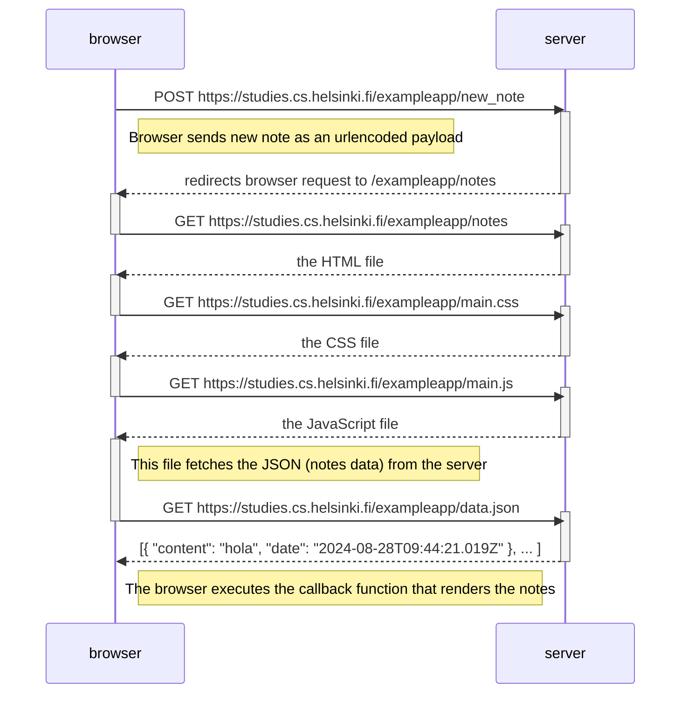

# Exercise 0.4
Illustrate the situation where the user creates a new note on the page https://studies.cs.helsinki.fi/exampleapp/notes by writing something into the text field and clicking the _Save_ button.

If necessary, show operations on the browser or on the server as comments on the diagram.

# Solution
<!--TODO 100% complete-->



- The browser sends a request to the server with the form data as an urlencoded payload.
- The server accepts the data and redirects the browser to exampleapp/notes so it fetches updated data.
- The browser requests to /notes and gets the HTML file.
- The link:stylesheet in the HTML file triggers a browser request to exampleapp/main.css. The browser gets the CSS file.
- The script element in the HTML file triggers a browser request to exampleapp/main.js. The browser gets the JS file.
- The JS file contains a call to XMLHttpRequest().open() with exampleapp/data.json as argument. The browser gets the JSON file.
- The JS file contains a callback that renders the data.


```
The requests initiator chain looks as follows:

https://studies.cs.helsinki.fi/exampleapp/new_note
  https://studies.cs.helsinki.fi/exampleapp/notes
    https://studies.cs.helsinki.fi/exampleapp/main.css
      https://studies.cs.helsinki.fi/exampleapp/main.js
        https://studies.cs.helsinki.fi/exampleapp/data.json
        
```