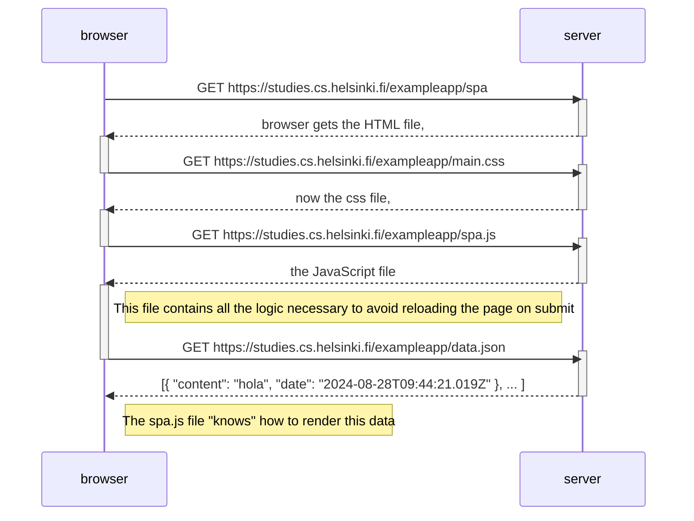

# Exercise 0.5
Create a diagram depicting the situation where the user goes to the single-page app version of the notes app at https://studies.cs.helsinki.fi/exampleapp/spa.

If necessary, show operations on the browser or on the server as comments on the diagram.

# Solution
<!--TODO 100% complete-->




- The browser sends a request to exampleapp/notes. The browser gets the HTML file.
- The link:stylesheet in the HTML file triggers a browser request to exampleapp/main.css. The browser gets the CSS file.
- The script element in the HTML file triggers a browser request to exampleapp/spa.js. The browser gets the JS file.
- The JS file contains a call to XMLHttpRequest().open() with exampleapp/data.json as argument. The browser gets the JSON file.
- The JS file contains all the logic necessary to render the data.
```
The requests initiator chain looks as follows:

https://studies.cs.helsinki.fi/exampleapp/spa
  https://studies.cs.helsinki.fi/exampleapp/main.css
    https://studies.cs.helsinki.fi/exampleapp/spa.js
      https://studies.cs.helsinki.fi/exampleapp/data.json
```