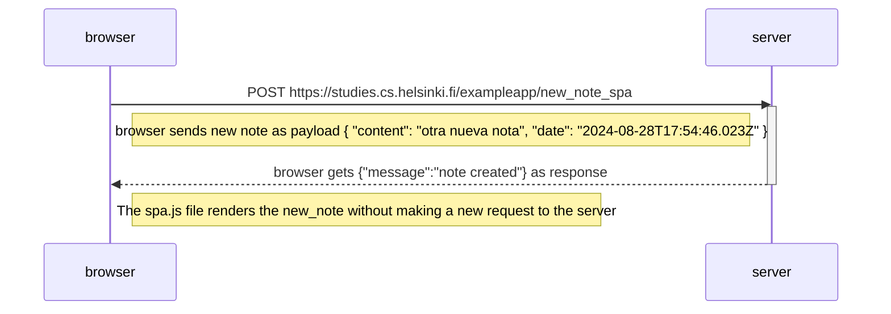

# Exercise 0.6
Create a diagram depicting the situation where the user creates a new note using the single-page version of the app.

If necessary, show operations on the browser or on the server as comments on the diagram.


# Solution
<!--TODO 100% complete-->




- The browser sends a request to exampleapp/new_note_spa. New note data is sent as application/json type.
- No new requests are made. The app renders every new note without reloading the page.
```
The requests initiator chain looks as follows:

There is no "chain". Only a single POST request.
```