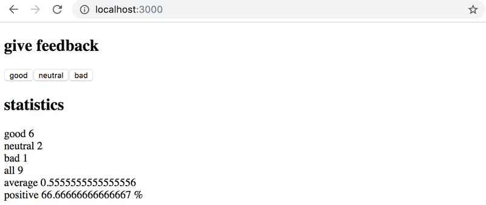

- [Exercise UNICAFE](#exercise-unicafe)
  - [STEP 1](#step-1)
  - [STEP 2](#step-2)
  - [STEP 3](#step-3)
  - [STEP 4](#step-4)
- [STEP 5](#step-5)

# [Exercise UNICAFE][00]

## STEP 1

Like most companies, the student restaurant of the University of Helsinki [Unicafe][01] collects feedback from its customers. Your task is to implement a web application for collecting customer feedback. There are only three options for feedback: good, neutral, and bad.

The application must display the total number of collected feedback for each category. Note that your application needs to work only during a single browser session. Once you refresh the page, the collected feedback is allowed to disappear. Your app could look like this:


It is advisable to use the same structure that is used in the material and previous exercise. Use the base code below.

```jsx
// main.jsx
import React from 'react'
import ReactDOM from 'react-dom/client'

import App from './App'

ReactDOM.createRoot(document.getElementById('root')).render(<App />)

// App.jsx
import { useState } from 'react'

const App = () => {
  // save clicks of each button to its own state
  const [good, setGood] = useState(0)
  const [neutral, setNeutral] = useState(0)
  const [bad, setBad] = useState(0)

  return (
    <div>
      code here
    </div>
  )
}

export default App
```

## STEP 2

Expand your application so that it shows more statistics about the gathered feedback: the total number of collected feedback, the average score (good: 1, neutral: 0, bad: -1) and the percentage of positive feedback.



## STEP 3
Refactor your application so that displaying the statistics is extracted into its own Statistics component. The state of the application should remain in the App root component.

Remember that components should not be defined inside other components,

```jsx
// a proper place to define a component
const Statistics = (props) => {
  // ...
}

const App = () => {
  const [good, setGood] = useState(0)
  const [neutral, setNeutral] = useState(0)
  const [bad, setBad] = useState(0)

  // do not define a component within another component
  const Statistics = (props) => {
    // ...
  }

  return (
    // ...
  )
}
```

## STEP 4
Change your application to display statistics only once feedback has been gathered.

# STEP 5
Let's continue refactoring the application. Extract the following two components:

`Button` handles the functionality of each feedback submission button.
`StatisticLine` for displaying a single statistic, e.g. the average score.
To be clear: the StatisticLine component always displays a single statistic, meaning that the application uses multiple components for rendering all of the statistics:

```jsx
const Statistics = (props) => {
  /// ...
  return(
    <div>
      <StatisticLine text="good" value ={...} />
      <StatisticLine text="neutral" value ={...} />
      <StatisticLine text="bad" value ={...} />
      // ...
    </div>
  )
}
```


[00]:https://fullstackopen.com/en/part1/a_more_complex_state_debugging_react_apps#exercises-1-6-1-14
[01]:https://www.unicafe.fi/
