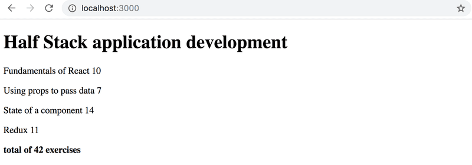

# Course Information - Part 2
_Exercises 2.1-2.5_

## Exercise 2.1 step 6
 - Based on the solution code for _courseinfo_ project in `part1`, define a single Component `Course` formatting all the info of any (if more than one) course.
 - Modularize the code, this way:
```
App
  Course
    Header
    Content
      Part
      Part
      ...
```
- The total sum of exercises is not needed yet.
- The app should work regardless of the number of parts a course has, so make sure to use iterable methods.

## Exercise 2.2 step 7
- Show also the sum of the exercises of the course.
