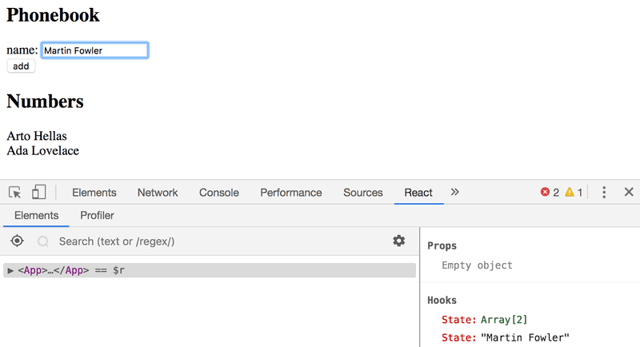

# Phonebook
_Exercises 2.6 - 2.10 from Part2_

## ✅Exercise 2.6 - The Phonebook step 1
Let's create a simple phonebook. In this part, we will only be adding names to the phonebook.

Let us start by implementing the addition of a person to the phonebook.

You can use the code below as a starting point for the App component of your application:
```jsx
import { useState } from 'react'

const App = () => {
  const [persons, setPersons] = useState([
    { name: 'Arto Hellas' }
  ]) 
  const [newName, setNewName] = useState('')

  return (
    <div>
      <h2>Phonebook</h2>
      <form>
        <div>
          name: <input />
        </div>
        <div>
          <button type="submit">add</button>
        </div>
      </form>
      <h2>Numbers</h2>
      ...
    </div>
  )
}

export default App;
```
The newName state is meant for controlling the form input element.

Sometimes it can be useful to render state and other variables as text for debugging purposes. You can temporarily add the following element to the rendered component: `<div>debug: { newName }</div>`

First look to our app:


## ✅Exercise 2.7 - The Phonebook Step 2
Prevent the user from being able to add names that already exist in the phonebook. JavaScript arrays have numerous suitable methods for accomplishing this task. Keep in mind how object equality works in Javascript.

Issue a warning with the `alert` command when such an action is attempted.

## ✅Exercise 2.8 - The Phonebook Step 3
Expand your application by allowing users to add phone numbers to the phone book. You will need to add a second input element to the form (along with its own event handler)

## ✅Exercise 2.9 - The Phonebook Step 4
Implement a search field that can be used to filter the list of people by name.

You can implement the search field as an input element that is placed outside the HTML form. The filtering logic shown in the image is case insensitive, meaning that the search term arto also returns results that contain Arto with an uppercase A.

Hardcode dummy data into your app to test this feature.

## ✅Exercise 2.10 - The Phonebook Step 5
If you have implemented your application in a single component, refactor it by extracting suitable parts into new components. Maintain the application's state and all event handlers in the App root component.

It is sufficient to extract three components from the application. Good candidates for separate components are, for example, the search filter, the form for adding new people to the phonebook, a component that renders all people from the phonebook, and a component that renders a single person's details.

The App.jsx should render only titles and let the rest of the components handle the rendering. 

## ✅Exercise 2.11 - The Phonebook Step 6
Store the initial state of the application in a `/db.json` file and start a json-server on port 3001, making sure the server returns the list of people in the file.

Then, refactor the App so the initial state is fetched with axios inside an effect hook.

### Dependencies stage
1. ✅create `/db.json` file
2. ✅install json-server --save-dev
3. ✅add a script "server": "json-server --port 3001 --watch db.json"
4. ✅install axios
5. ✅`npm run server`
6. ✅browser http://localhost:3001/persons, verify the data is being served.

### Refactor stage
1. ✅import axios
2. ✅add useEffect to react imports
3. ✅declare useEffect hook: `useEffect(hook, [])`
4. ✅inside hook, fetch url and set state.

## ✅Exercise 2.12 - The Phonebook Step 7
Currently, the numbers that are added to the phonebook are not saved to a backend server. Fix this situation.

1. ✅Create an axios.post request in `addNewPerson()`
2. ✅`setPersons(persons.concat(returnedPerson));` to set persons with the returned object. 
3. 👁️Don't concat the user-input object since the request could `reject` and no re-rendering should be made.

## ✅Exercise 2.13 - The Phonebook Step 8
Extract the code that handles the communication with the backend into its own module by following the example shown earlier in this part of the course material.

1. ✅create `/src/services/persons.js`
2. ✅move the axios logic into this file. `getAll` and `create` so far.
3. ✅refactor `useEffect` and `addNewPerson` in `App.jsx`

## Exercise 2.14 - The Phonebook Step 9
Make it possible for users to delete entries from the phonebook. The deletion can be done through a dedicated button for each person in the phonebook list. You can confirm the action from the user by using the window.confirm method. The associated resource for a person in the backend can be deleted by making an HTTP DELETE request to the resource's URL. If we are deleting e.g. a person who has the id 2, we would have to make an HTTP DELETE request to the URL localhost:3001/persons/2. No data is sent with the request.

You can make an HTTP DELETE request with the axios library in the same way that we make all of the other requests.

Don't use `delete` as method name because is JS reserved word.

## Exercise 2.15 - The Phonebook Step 10
Change the functionality so that if a number is added to an already existing user, the new number will replace the old number. It's recommended to use the HTTP PUT method for updating the phone number.

If the person's information is already in the phonebook, the application can ask the user to confirm the action.